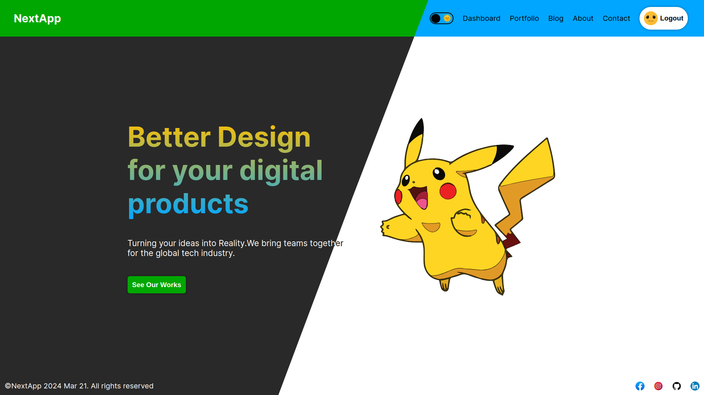
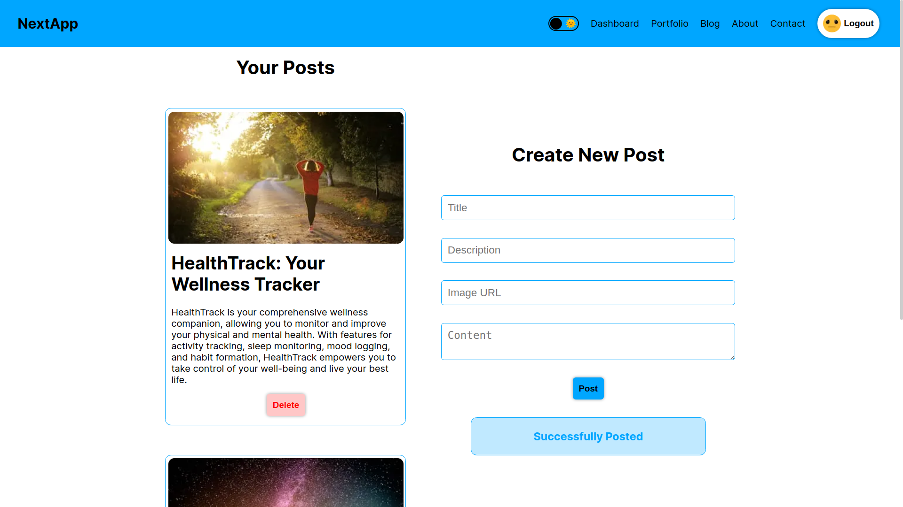
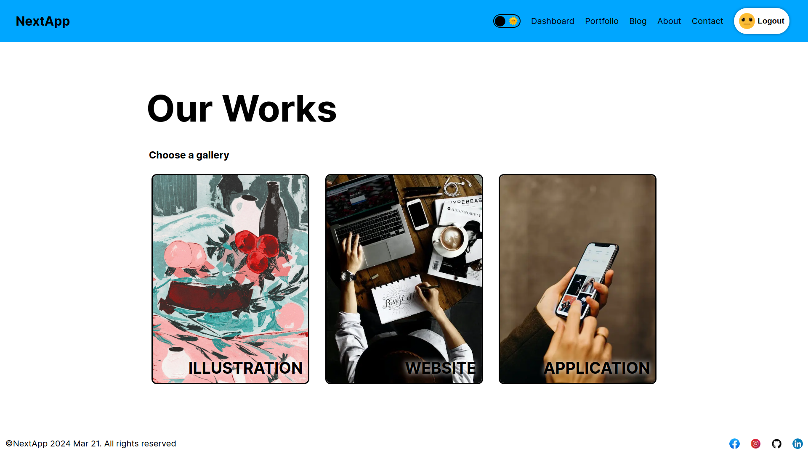
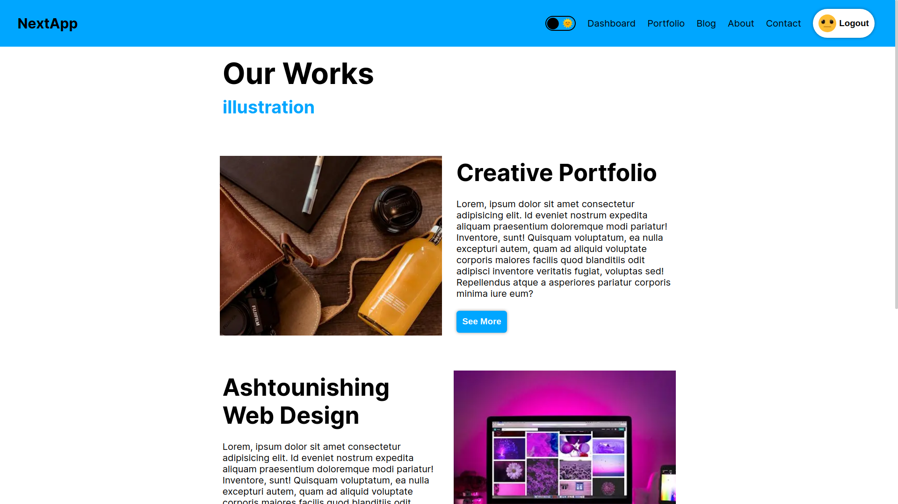
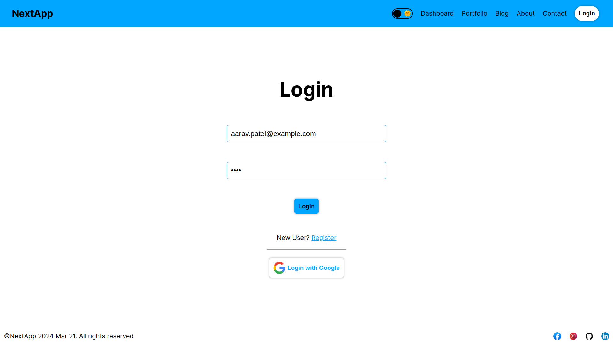
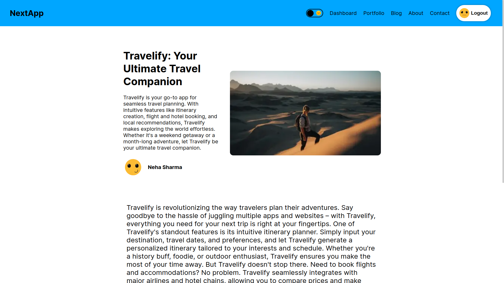

# Live link 🌐

### [NextApp](https://next-app-git-main-shouryaraj-singhs-projects.vercel.app/)

## Launch Locally 🚀

First, run the development server:

```bash
npm run dev
```
### .env file 🌲
```
MONGO=""
API_URL=http://localhost:3000/api
GOOGLE_CLIENT_SECRET=""
GOOGLE_CLIENT_ID=""

NEXTAUTH_SECRET=""
NEXTAUTH_URL=http://localhost:3000
```

Open [http://localhost:3000](http://localhost:3000) with your browser to see the result.

## ScreenShots







